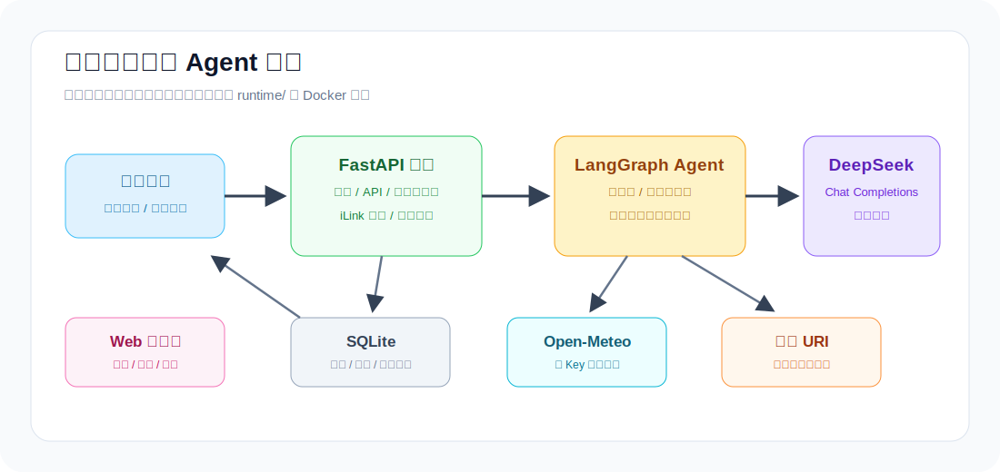
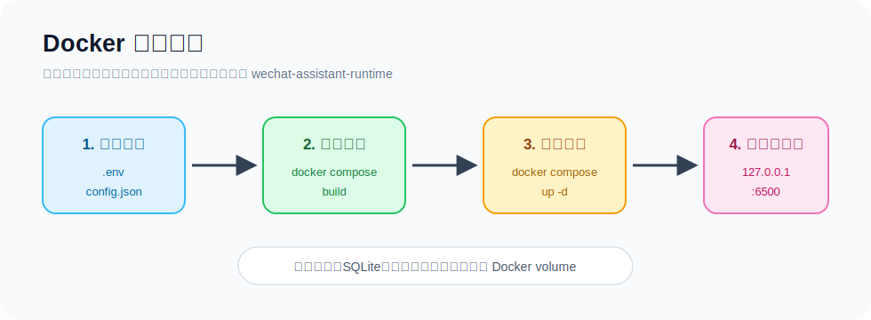
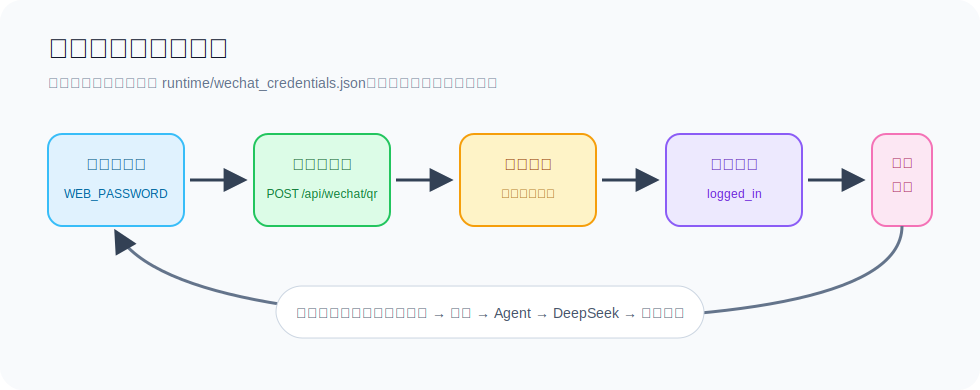

# 自研微信私人 Agent

一个从零实现的私人微信 Agent 项目，用于把个人微信消息接入本地 FastAPI 服务，再由 LangGraph Agent 调用 DeepSeek 生成回复。CowAgent 仅作为协议和产品边界参考，本仓库不继续 Fork CowAgent。



## 目录

- [项目状态](#项目状态)
- [能力边界](#能力边界)
- [快速启动：Docker](#快速启动docker)
- [本机开发启动](#本机开发启动)
- [微信登录与使用流程](#微信登录与使用流程)
- [配置说明](#配置说明)
- [地点别名与导航](#地点别名与导航)
- [天气查询](#天气查询)
- [macOS 常驻运行](#macos-常驻运行)
- [云端部署建议](#云端部署建议)
- [测试与质量检查](#测试与质量检查)
- [安全边界](#安全边界)
- [常见问题](#常见问题)

## 项目状态

已落地 Phase 0-3 的工程骨架：

- Python 3.12 + FastAPI 后端；
- React + TypeScript + Vite 控制台；
- JSON + `.env` 配置；
- SQLite 会话、消息、运行记录表；
- DeepSeek OpenAI-compatible Chat Completions 客户端；
- LangGraph 最小聊天状态机，缺少依赖时有顺序执行 fallback；
- iLink 微信二维码、扫码轮询、长轮询、文本回复适配层；
- Web 控制台密码登录；
- 工具 allowlist 注册层与执行层；
- 无 Key 的本地点别名与高德 URI 导航链接；
- 无 Key 的 Open-Meteo 实时天气和短期预报；
- 日志脱敏；
- 单元测试与 Docker 构建验证。

## 能力边界

当前支持：

- 控制台登录、状态查看、Web 聊天；
- 微信二维码登录、扫码状态轮询、微信长轮询；
- 文本消息回复；
- 本地 SQLite 持久化；
- 天气查询；
- 本地点别名导航链接生成；
- Docker 单容器部署。

暂未启用：

- 高德 Web 服务查询：天气、POI、地理编码与路线详情需要 Key；
- 语音、图片、文件、群聊、多用户；
- 支付、下单、打车、后台定位；
- 终端、浏览器、插件安装等高风险工具。

## 快速启动：Docker

如果你已经安装好 Docker，推荐先走这条路径。容器会构建前端静态资源并启动后端，控制台由后端直接提供。

日常扫码登录和正常使用只需要打开：

```text
http://127.0.0.1:6500
```

`5500` 只用于前端开发热更新；不改控制台界面时可以忽略。



### 1. 准备配置

首次使用时，从示例文件生成本地配置：

```bash
cp .env.example .env
cp config.example.json config.json
```

编辑 `.env`，至少填写：

```text
DEEPSEEK_API_KEY=你的 DeepSeek Key
WEB_PASSWORD=控制台密码
```

`AMAP_MAPS_API_KEY` 可留空。留空时，高德 Web 服务查询保持禁用，但本地点别名导航 URL 仍可用。

### 2. 构建并启动

```bash
docker compose build
docker compose up -d
docker compose ps
```

服务默认只绑定本机：

```text
http://127.0.0.1:6500
```

### 3. 查看日志与停止服务

```bash
docker compose logs -f agent
docker compose down
```

### 4. 一键验证 Docker 构建

```bash
make docker-verify
```

该命令会校验 Compose 配置、构建镜像，并在容器中导入后端应用做基础检查。

## 本机开发启动

本机开发模式会分别启动后端和前端开发服务，适合改代码时使用。

这种模式下，`5500` 是你看的控制台页面，`6500` 是前端调用的 API 服务。

### 1. 初始化环境

```bash
scripts/bootstrap-local.sh
```

脚本会创建 `.venv`、安装 Python 和前端依赖，并在缺失时生成 `.env` 与 `config.json`。

### 2. 编辑本地配置

```bash
.env
config.json
```

`.env` 至少填写：

```text
DEEPSEEK_API_KEY=你的 DeepSeek Key
WEB_PASSWORD=控制台密码
```

### 3. 启动后端

```bash
scripts/run-backend.sh
```

后端默认：

```text
http://127.0.0.1:6500
```

### 4. 启动前端开发服务

```bash
make frontend-dev
```

前端默认：

```text
http://127.0.0.1:5500
```

## 微信登录与使用流程



1. 打开控制台并输入 `WEB_PASSWORD` 登录。
2. 点击“获取二维码”。
3. 使用个人微信扫码。
4. 点击“轮询扫码状态”，直到状态变为 `logged_in`。
5. 点击“启动微信轮询”。
6. 给微信 Agent 发送文本消息。

微信凭证保存在：

```text
runtime/wechat_credentials.json
```

`runtime/` 已被 Git 忽略，不应提交。云端部署时也不要复制本机的微信凭证。

## 配置说明

### `.env`

| 变量 | 必填 | 说明 |
| --- | --- | --- |
| `DEEPSEEK_API_KEY` | 是 | DeepSeek API Key |
| `WEB_PASSWORD` | 是 | 控制台登录密码 |
| `AMAP_MAPS_API_KEY` | 否 | 高德 Web 服务 Key，留空时相关外部查询禁用 |

### `config.json`

主要配置项：

| 路径 | 默认值 | 说明 |
| --- | --- | --- |
| `model.provider` | `deepseek` | 模型服务提供方 |
| `model.model` | `deepseek-v4-flash` | DeepSeek 模型名 |
| `web.host` | `127.0.0.1` | Web 监听地址，当前强制本机私有使用 |
| `web.port` | `6500` | 后端端口 |
| `web.serve_frontend` | `false` | 是否由后端托管 `frontend/dist` |
| `agent.tool_allowlist` | `[]` | Agent 可调用工具白名单 |
| `agent.weather_enabled` | `true` | 是否启用天气查询 |
| `wechat.credentials_path` | `./runtime/wechat_credentials.json` | 微信登录凭证路径 |
| `storage.sqlite_path` | `./runtime/agent.sqlite3` | SQLite 数据库路径 |
| `profile.path` | `./profile.local.json` | 本地点别名配置路径 |
| `logging.path` | `./runtime/logs/app.log` | 应用日志路径 |

## 地点别名与导航

复制示例文件：

```bash
cp profile.local.example.json profile.local.json
```

然后填入你自己的地点名称和经纬度。`profile.local.json` 已被 Git 忽略，不能提交。

登录控制台后，可调用受鉴权保护的导航接口：

```http
POST /api/maps/navigation
```

`destination` 和可选的 `origin` 必须是已保存的地点别名。接口只生成确定性的高德导航 URL，不查询外部服务，也不需要 Key。省略 `origin` 时，移动端高德可使用设备当前位置。

查看地图能力状态：

```http
GET /api/maps/status
```

未填写 `AMAP_MAPS_API_KEY` 时，POI、地址解析和路线详情保持禁用，系统不会猜测地点或请求第三方服务。

## 天气查询

发送明确城市的天气问题，例如：

```text
上海明天天气怎么样
```

Agent 会调用 Open-Meteo 的公开地理编码和预报服务，回复数据时间和来源。也可在登录后调用：

```http
GET /api/weather?location=上海&day_offset=0
```

天气服务开关位于 `config.json` 的 `agent.weather_enabled`，默认启用。天气查询需要网络连接；地点不明确、无法找到地点或服务临时失败时，Agent 会说明原因而不会猜测结果。

## macOS 常驻运行

项目提供当前 macOS 用户范围的 LaunchAgent 模板。它只启动后端并绑定 `127.0.0.1:6500`；已有微信凭证时，后端启动后会自动恢复微信轮询。

前端如需由后端提供，请先执行一次：

```bash
cd frontend && npm run build
```

然后在 `.env` 中开启：

```text
APP_SERVE_FRONTEND=1
```

确认 `.env`、`.venv` 和 `config.json` 都已准备完成后，显式执行：

```bash
scripts/launchd-agent.sh install
```

查看状态或移除常驻服务：

```bash
scripts/launchd-agent.sh status
scripts/launchd-agent.sh uninstall
```

生成的 plist 位于 `~/Library/LaunchAgents/`，运行日志位于：

```text
runtime/logs/launchd.stdout.log
runtime/logs/launchd.stderr.log
```

安装脚本不会把环境变量或密钥写入 plist，凭证和运行时数据也不会在卸载时删除。

## 云端部署建议

Docker 镜像固定使用 Python 3.12.13、Node 22.23.1 和 `requirements.lock` 中锁定的运行依赖；前端在构建阶段编译，最终镜像以非 root 用户运行。`.dockerignore` 会排除 `.env`、`config.json`、本机 `runtime/` 和 `profile.local.json`，因此它们不会进入镜像层。

Compose 只发布 `127.0.0.1:6500`，并将容器的运行数据保存到命名卷 `wechat-assistant-runtime`。不要以端口映射、反向代理或防火墙规则把该服务直接公开到互联网。

云端应使用全新仓库副本和一个空的 `wechat-assistant-runtime` 卷，然后在云端控制台重新扫码登录。绝不能复制、上传或挂载本机：

```text
runtime/wechat_credentials.json
```

需要从本机访问云端实例时，使用 SSH 隧道：

```bash
ssh -L 6500:127.0.0.1:6500 your-user@your-server
```

## 测试与质量检查

```bash
make test
make lint
```

当前测试覆盖：

- API 与鉴权；
- 配置加载；
- SQLite 存储；
- Docker 配置；
- launchd 模板；
- 工具 allowlist；
- 天气服务；
- 地图服务；
- 微信服务。

## 安全边界

- Web 默认只监听 `127.0.0.1`。
- `config.py` 会校验 `web.host` 必须保持 `127.0.0.1`。
- 首版工具白名单为空，因此模型不能调用任何外部工具。
- 工具执行层会再次校验 allowlist，防止伪造调用。
- 日志会脱敏 key、token、password、secret、context_token。
- `.env`、`config.json`、`runtime/`、`profile.local.json` 不进入 Docker 镜像层。
- 不支持终端、文件、浏览器、插件安装、支付、下单、打车或后台定位。

## 常见问题

### Docker 启动后访问哪个地址？

访问：

```text
http://127.0.0.1:6500
```

Docker 模式下前端已经被构建进镜像，由后端直接提供。

### 本机开发时应该打开哪个地址？

打开前端开发服务：

```text
http://127.0.0.1:5500
```

后端地址 `http://127.0.0.1:6500` 只作为 API 服务使用。这样可以避免 5500 和 6500 同时显示两套看起来一样、但构建来源不同的界面。

### 为什么地图导航接口提示 profile 未配置？

需要先创建并填写：

```bash
cp profile.local.example.json profile.local.json
```

如果只使用聊天、天气和微信登录，可以暂时不配置它。

### 可以把服务开放到公网吗？

不建议。当前项目按私人本机服务设计，只绑定 `127.0.0.1`。需要远程访问时，用 SSH 隧道，不要直接暴露端口。

### 微信登录后云端也能复用本机凭证吗？

不能。云端必须重新扫码登录。不要复制、上传或挂载本机的 `runtime/wechat_credentials.json`。
